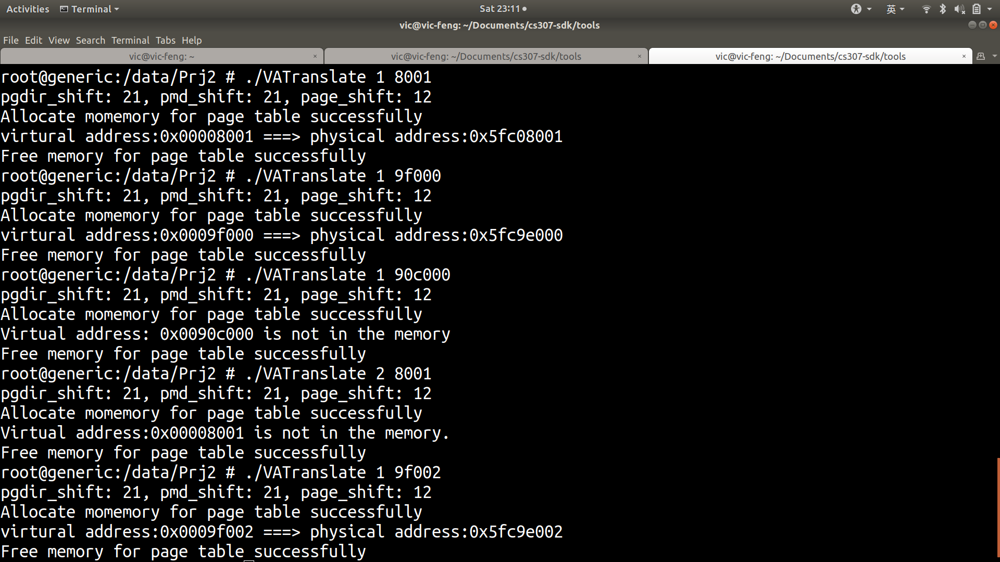
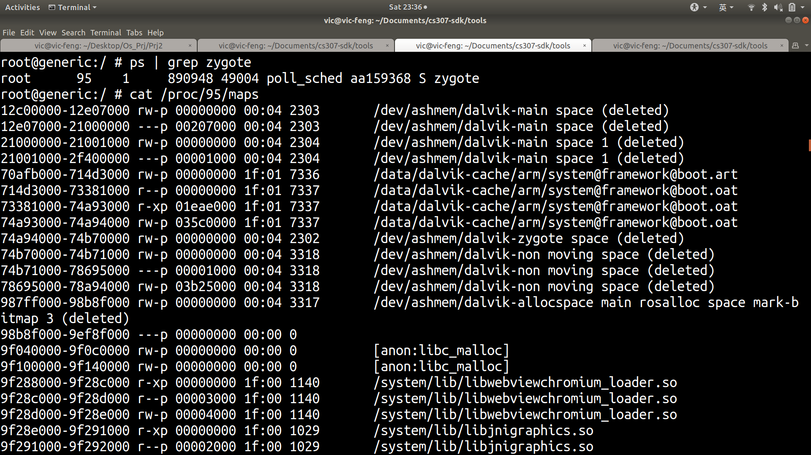
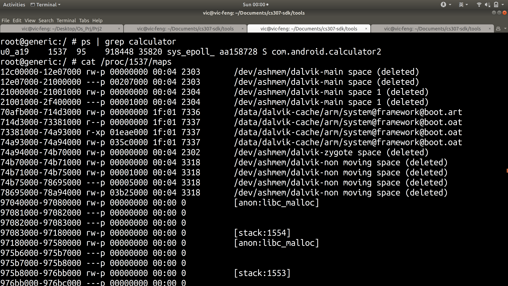
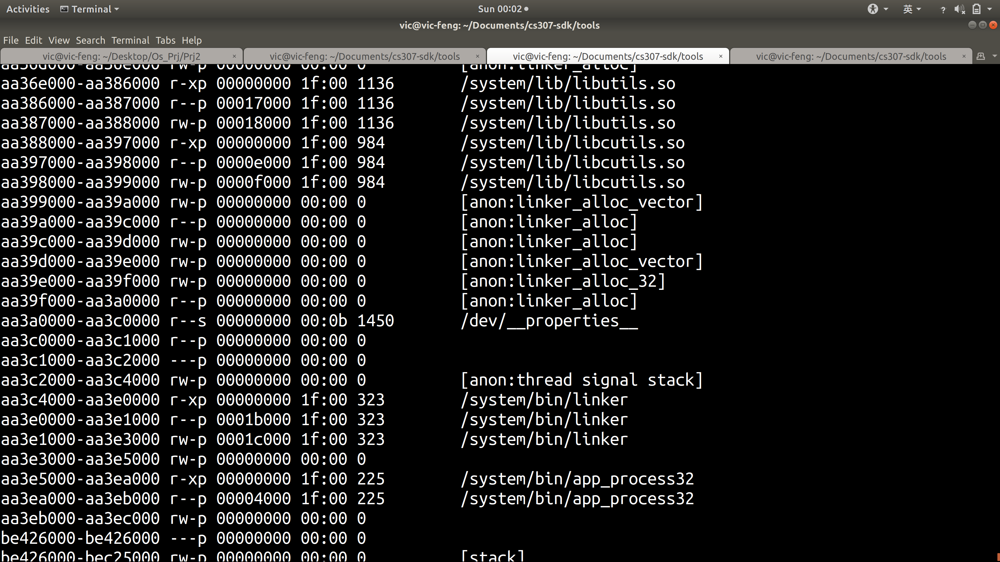
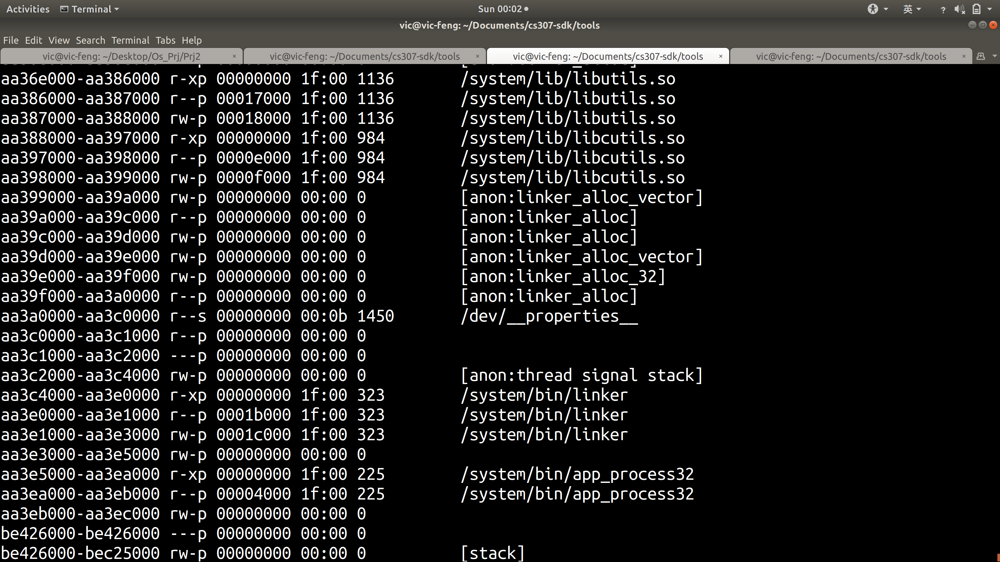
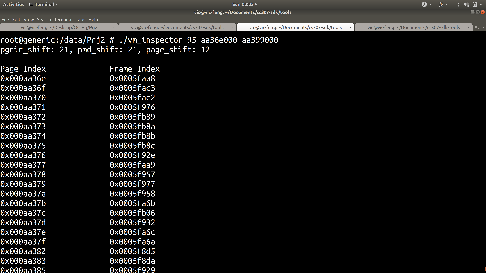
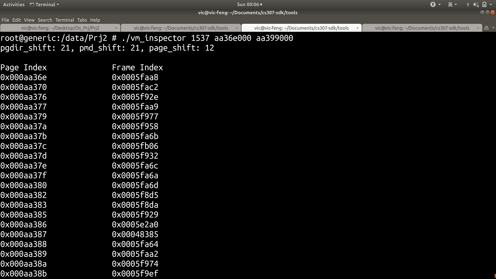
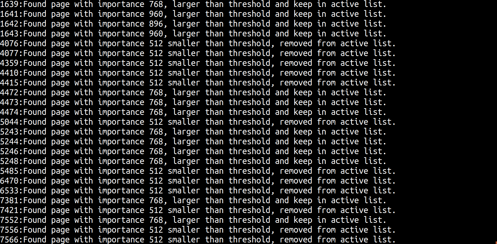

# Android Memory Management

## Objective

1. Complied the Android Kernel
2. Familiarize with Android Page Replacement Algorithm
3. Get the target process's virtual address and physical address
4. Implement a new page replacement algorithm

## Project Environment

- AVD (Android Virtual Devices) provided by TA.
- SDK provided by TA.
- Ubuntu 18.04 LTS

## Implementation Details

### Problem 1 : Compile the kernel

#### Description

In this problem, we need to compile the kernel and enables some other features. 

#### Analysis

1. Add following path to the path environment variables

   ```shell
   ANDROID_NDK_HOME/toolchains/arm-linux-androideabi-4.6/prebuilt/linux-x86_64/bin
   ```

2. Change the *Makefile* in *KERNEL_SOURCE/goldfish* and change these

   ```
   ARCH ?= arm
   CROSS_COMPILE ?= arm-linux-androideabi
   ```

3. Execute following command to set compile config

   ```shell
   make goldfish_armv7_defconfig
   ```

4. Modify compiling configure shown in instruction files provided by TA

   ```shell
   sudo apt-get install ncurses-dev
   make menuconfig
   ```

5. Compile the kernel

   ```shell
   make -j4
   ```

### Problem 2: Get the physical address of a target process

#### Description

In the Linux kernel, the page table is broken into **multiple levels**. For ARM64-based devices, a **three-level paging** mechanism is used. 

For this problem, we are going to implement the following two system call interfaces, and then use them to implement an `VATranslate` program to test our calls, which can get the physical address via command `./VATranslate #pid #VA` . 

The required system call interfaces are as follows:

```c
int get_pagetable_layout(struct pagetable_layout_info __user * pgtbl_info, int size);
int expose_page_table(pid_t pid,unsigned long fake_pgd ,unsigned long fake_pmds, unsigned long page_table_addr, unsigned long begin_vaddr, unsigned long end_vaddr);
```

The required structure is shown as follows:

```c
struct pagetable_layout_info {
uint32_t pgdir_shift;
uint32_t pmd_shift;
uint32_t page_shift;
};
```

#### Analysis

In the first project, we learn to write a module which defines new system calls. So in this project, we also write a simple module which provides above two system calls. It's more convenient for us to debug and run our program. 

In the first system call `get_pagetable_layout`, we only need to store the page layout information to the predefined structure. Actually, in `arch/arm/include/asm/pgtable\*.h` files, we find the desired macro like `PGDIR_SHIFT`, `PMD_SHIFT`, `PAGE_SHIFT`. 

So the first system call can be implemented as follows

```c
/**
 * This function is used to investigate the page table layout. 
 * 
 * Args:
 *      pgtbl_info: user address to store the related information
 *      size: the memory size reserved for pgtbl_info
 */
static int get_pagetable_layout(struct pagetable_layout_info __user *pgtbl_info, int size) {
    struct pagetable_layout_info layout;

    /* Sanity check */
    if (!pgtbl_info || size < sizeof(struct pagetable_layout_info)) 
    {
        printk(KERN_INFO "The size is too small for struct pagetable_layout_info. \n");
        return -1;
    }

    /* Get current page layout information */
    layout.pgdir_shift = PGDIR_SHIFT;
    layout.pmd_shift = PMD_SHIFT;
    layout.page_shift = PAGE_SHIFT;

    /* Print the page table layout information in the kernel */
    printk(KERN_INFO "The pgdir_shift is %d\n", layout.pgdir_shift);
    printk(KERN_INFO "The pmd_shift is %d\n", layout.pmd_shift);
    printk(KERN_INFO "The page_shift is %d\n", layout.page_shift);

    /* Copy the page table layout information to user space */
    if(copy_to_user(pgtbl_info, &layout, sizeof(struct pagetable_layout_info))) 
    {
        printk("Copy from kernel to user failed\n");
        return -1;
    }

    return 0;
}
```

 However, the second system call is a bit more tricky. And we chop this problem to several parts. 

In the first part, we implement a function to get the `task_struct` of given process `pid`. Since we need it for investigating virtual memory in the future.  We use `find_get_pid` and `pid_task` procedures provided by kernel in this function. 

```c
/**
 * This function is used to get the task_struct of process Pid.
 * 
 * Args:
 *      pid_t process Pid
 * 
 * Return:
 *      The task_struct of process Pid
 */ 
struct task_struct* get_Pid_task(pid_t Pid) {
    /* A struct pid is the kernel internal notion of process identifier */
    struct pid *Pid_struct;
    /* The task_struct of process Pid */
    struct task_struct *Pid_task;

    /* Lookup a Pid in the hash table, and return struct pid pointer */
    Pid_struct = find_get_pid(Pid);
    /* Get the task_struct of process PID */
    Pid_task = pid_task(Pid_struct, PIDTYPE_PID);

    return Pid_task;
}
```

  

In the next part, we found that `task_struct -> mm -> mmap` is the `vm_area_struct` which is very useful. And its `vm_start` and `vm_end` indicate the begin virtual address and end virtual address. `vm_next` points to the next `vm_area_struct`. 

Under the lock provided by `mm -> mmap_sem`, we can provide virtual address for this `task_struct`. So we implement following codes in the second system interface:

```c
/**
 * This function is used to map a target process's page table into the 
 * current process's address space. 
 * 
 * Args:
 *     pid: pid of the target process you want to investigate
 *     fake_pid: base address of the fake pgd
 *     fake_pmds: base address of the fake pmds
 *     page_table_addr: base address in user space the ptes mapped to
 *     begin_vaddr: remapped memory beginning of the target process
 *     end_vaddr: remapped memory end of the target process
 */
static int expose_page_table(pid_t Pid, unsigned long fake_pgd, unsigned long fake_pmds, unsigned long page_table_addr, unsigned long begin_vaddr, unsigned long end_vaddr) {
    printk(KERN_INFO "Syscall expose_page_table invoked!");

    struct task_struct *Pid_task = NULL;
    struct mm_struct *Pid_mm = NULL;
    struct vm_area_struct *Pid_vm = NULL;
    struct vm_area_struct *tmp_vm = NULL;
    struct mm_walk walk = {};
    struct walk_info copy_info = {};    

    /* Get the task_struct for process Pid */
    Pid_task = get_Pid_task(Pid);

    /* Sanity check for invalid process id */
    if(!Pid_task)
    {
        printk(KERN_INFO "The process id is invalid\n");
        return -1;
    }

    printk(KERN_INFO "The target process is %s.\n", Pid_task -> comm);

    /* Get the mm_struct for process Pid */
    Pid_mm = Pid_task -> mm;

    /* Sanity check for invalid Pid_mm */
    if(!Pid_mm)
    {
        printk(KERN_INFO "The memory struct is invalid\n");
        return -1;
    }

    /* Get the vm_area_struct for process Pid */
    Pid_vm = Pid_mm -> mmap;

    /* Sanity check for invalid pid_Vm */
    if(!Pid_vm)
    {
        printk(KERN_INFO "The virtual memory struct is invalid\n");
        return -1;
    }


    /* Print the virtual memory address under lock */
    down_write(&Pid_mm -> mmap_sem);
    for(tmp_vm = Pid_vm; tmp_vm ; tmp_vm = tmp_vm -> vm_next) {
        printk(KERN_INFO "0x%08lx - 0x%08lx\n", tmp_vm -> vm_start, tmp_vm -> vm_end);
    }
    up_write(&Pid_task -> mm -> mmap_sem);
}
```

In the final part, we use the useful function `walk_page_range` which can recursively walk the page table for memory areas in specified `vm_area`. The `remap_pfn_range` can remap the given physical frame to user space.

But the `walk_page_range` function hasn't been exported and we need to modify two files in the linux kernel. So we first add `entern` before the function prototype of `walk_page_range` in `include/linux/mm.h`. Next we add two lines below in `mm/pagewalk.c`. 

```c
#include <linux/export.h>
EXPORT_SYMBOL(walk_page_range)
```

Before invoke the `walk_page_range` function, we need to first define our callback function when we recursively walk the page table. And we also need to define a new structure which stores needed information. 

The `walk_info` structure are defined as follows

```c
/* The structure for storing walk information */
struct walk_info
{
    unsigned long pgtb_start;
    unsigned long fake_pgd;
    unsigned long *copied_pgd;
};
```


And we configure the `walk_info` structure as follows

```c
 /* Configure the walk_info struct */
 copy_info.pgtb_start = page_table_addr;
 copy_info.fake_pgd = fake_pgd;
 copy_info.copied_pgd = kcalloc(PAGE_SIZE, sizeof(unsigned long), GFP_KERNEL);

```

In the callback function `my_pgd_entry`, the core code is to remap from the physical frame to user space and store other information in `copy_info` structure. The implementation is shown as follows:

```c
/* Call back function */
int my_pgd_entry(pmd_t *pgd, unsigned long addr, unsigned long end, struct mm_walk *walk)
{
    /* Get the page index of addr */
    unsigned long pgdIndex = pgd_index(addr);
    /* Get the page address of the pgd page */
    unsigned long pgdPage = pmd_page(*pgd);
    /* Get the physical frame number of the pgdPage */
    unsigned long pgdPfn = page_to_pfn((struct page *)pgdPage);

    /* Sanity check for invalid pgd */
    if(pgd_none(*pgd) || pgd_bad(*pgd) || !pfn_valid(pgdPfn))
    {
        printk(KERN_INFO "Invalid pgdPage!\n");
        return -1;
    }

    /* Get the walk_info struct to store information */
    struct walk_info *copy_info = walk -> private;

    /* Sanity check for invalid walk_info */
    if(!copy_info)
    {
        printk(KERN_INFO "Invalid copy_info\n");
        return -1;
    }

    /* Get current process vm_area_struct */
    struct vm_area_struct *current_vma = current -> mm -> mmap;

    /* Sanity check for invalid vm */
    if(!current_vma)
    {
        printk(KERN_INFO "Invalid user vm area!");
        return -1;
    }

    /* Remap the whole memory frame to user space */
    down_write(&current -> mm -> mmap_sem);
    int err = remap_pfn_range(current_vma, copy_info -> pgtb_start, pgdPfn, PAGE_SIZE, current_vma -> vm_page_prot);
    up_write(&current -> mm -> mmap_sem);

    /* Sanity check for remap error */
    if(err)
    {
        printk(KERN_INFO "remap_pgdPfn_range failed!\n");
        return -1;
    }

    /* Store other information in kernel space */
    copy_info -> copied_pgd[pgdIndex] = copy_info -> pgtb_start;
    copy_info -> pgtb_start += PAGE_SIZE;

    return 0;
}
```

Finally under the lock provided by `mm -> mmap_sem`, we can safely call `walk_page_range` function with our predefined call back function `my_pgd_entry`.  And the implementation is shown as follows:

```c
/**
 * This function is used to map a target process's page table into the 
 * current process's address space. 
 * 
 * Args:
 *     pid: pid of the target process you want to investigate
 *     fake_pid: base address of the fake pgd
 *     fake_pmds: base address of the fake pmds
 *     page_table_addr: base address in user space the ptes mapped to
 *     begin_vaddr: remapped memory beginning of the target process
 *     end_vaddr: remapped memory end of the target process
 */
static int expose_page_table(pid_t Pid, unsigned long fake_pgd, unsigned long fake_pmds, unsigned long page_table_addr, unsigned long begin_vaddr, unsigned long end_vaddr) {
    printk(KERN_INFO "Syscall expose_page_table invoked!");

    struct task_struct *Pid_task = NULL;
    struct mm_struct *Pid_mm = NULL;
    struct vm_area_struct *Pid_vm = NULL;
    struct vm_area_struct *tmp_vm = NULL;
    struct mm_walk walk = {};
    struct walk_info copy_info = {};    

    /* Get the task_struct for process Pid */
    Pid_task = get_Pid_task(Pid);

    /* Sanity check for invalid process id */
    if(!Pid_task)
    {
        printk(KERN_INFO "The process id is invalid\n");
        return -1;
    }

    printk(KERN_INFO "The target process is %s.\n", Pid_task -> comm);

    /* Get the mm_struct for process Pid */
    Pid_mm = Pid_task -> mm;

    /* Sanity check for invalid Pid_mm */
    if(!Pid_mm)
    {
        printk(KERN_INFO "The memory struct is invalid\n");
        return -1;
    }

    /* Get the vm_area_struct for process Pid */
    Pid_vm = Pid_mm -> mmap;

    /* Sanity check for invalid pid_Vm */
    if(!Pid_vm)
    {
        printk(KERN_INFO "The virtual memory struct is invalid\n");
        return -1;
    }


    /* Print the virtual memory address under lock */
    down_write(&Pid_mm -> mmap_sem);
    for(tmp_vm = Pid_vm; tmp_vm ; tmp_vm = tmp_vm -> vm_next) {
        printk(KERN_INFO "0x%08lx - 0x%08lx\n", tmp_vm -> vm_start, tmp_vm -> vm_end);
    }
    up_write(&Pid_task -> mm -> mmap_sem);

    /* Configure the mm_walk struct */
    walk.mm = Pid_mm;
    walk.pgd_entry = &my_pgd_entry;

    /* Configure the walk_info struct */
    copy_info.pgtb_start = page_table_addr;
    copy_info.fake_pgd = fake_pgd;
    copy_info.copied_pgd = kcalloc(PAGE_SIZE, sizeof(unsigned long), GFP_KERNEL);

    walk.private = &copy_info;

    /* Set current vm_flags (make vm non-mergable) */
    current -> mm -> mmap -> vm_flags |= VM_SPECIAL;

    /* Walk the page table recursively with our callback function */
    down_write(&Pid_mm -> mmap_sem);
    if(walk_page_range(begin_vaddr, end_vaddr, &walk))
    {
        printk(KERN_INFO "Walk failed\n");
        up_write(&Pid_task -> mm -> mmap_sem);
        return -1;
    }
    up_write(&Pid_task -> mm -> mmap_sem);

    /* Copy to user and sanity check */
    if(copy_to_user(fake_pgd, copy_info.copied_pgd, sizeof(unsigned long) * PAGE_SIZE))
    {
        printk(KERN_INFO "Copy to user failed\n");
        return -1;
    }


    /* Free the kernel space */
    kfree(copy_info.copied_pgd);
    
    /* Print the successful exit information */
    printk(KERN_INFO "Syscall expose_page_table exited!");
    return 0;

}
```

`VATranslate` programs is really easy and we can just use this two system calls to get the needed information. And we can use it to find the physical address of the input virtual address. The implementation is shown as follows:

```c
#include<unistd.h>
#include <stdio.h>
#include <sys/mman.h>
#define pgd_index(va, info) ((va) >> info.pgdir_shift)
#define pte_index(va, info) (((va) >> info.page_shift)&((1 << (info.pmd_shift - info.page_shift)) - 1))
#define syscall_get_layout 356
#define syscall_expose 357

/* The page table layout struct */
struct pagetable_layout_info {
    uint32_t pgdir_shift;
    uint32_t pmd_shift;
    uint32_t page_shift; 
};
/* Call expose_page_table system call */
int expose_page_table(pid_t Pid, unsigned long fake_pgd, unsigned long fake_pmds, unsigned long page_table_addr, 
unsigned long begin_vaddr, unsigned long end_vaddr) {
    return syscall(syscall_expose, Pid, fake_pgd, fake_pmds, page_table_addr, begin_vaddr, end_vaddr);
}

/* Call get_pagetable_layout system call */
int get_pagetable_layout(struct pagetable_layout_info *pgtbl_info, int size) {
    return syscall(syscall_get_layout, pgtbl_info, size);
}

/* Display the pagetable layout info */
int display_layout(struct pagetable_layout_info *info)
{
    /* Sanity check for null pointer */
    if(!info)
    {
        printf("Invalid pagetable_layout_info structure\n");
        return -1;
    }
    printf("pgdir_shift: %d, pmd_shift: %d, page_shift: %d\n", info -> pgdir_shift, info -> pmd_shift, info -> page_shift);
    return 0;
}

/* Allocate memory for page table */
int allocate_pagetable(struct pagetable_layout_info *info, unsigned long **page_table_addr, unsigned long **fake_pgd_addr)
{
    unsigned long page_size = 1 << (info -> page_shift);
    *page_table_addr = mmap(NULL, page_size, PROT_READ | PROT_WRITE, MAP_SHARED | MAP_ANONYMOUS, -1, 0);
    *fake_pgd_addr = malloc(sizeof(unsigned long) * page_size);
    if(!(*page_table_addr) || !(*fake_pgd_addr))
    {
        printf("Allocate memory failed\n");
        return -1;
    }
    printf("Allocate momemory for page table successfully\n");
    return 0;
}

/* Free memory for page table */
int free_pagetable(struct pagetable_layout_info *info, unsigned long **page_table_addr, unsigned long **fake_pgd_addr)
{
    unsigned long page_size = 1 << (info -> page_shift);
    free(*fake_pgd_addr);
    munmap(*page_table_addr, page_size);
    printf("Free memory for page table successfully\n");
    return 0;
}

/* Display helper message */
void helper()
{
    printf("Usage: ./VATranslate pid virtual_addr\n");
    printf("Example: ./VATranslate 1 8001\n");
}
int main(int argc, char **argv) {
    /* The process id */
    pid_t pid;
    /* info stores the pagetable layout information */
    struct pagetable_layout_info info;
    /* Define the page_size and the page_mask */
    unsigned long page_size, page_mask;
    /* Define the address for page table */
    unsigned long *page_table_addr, *fake_pgd_addr;
    /* Define the virtual memory address */
    unsigned long va;
    /* Define the return value */
    int ret;

    /* Sanity check for input arguments */
    if(argc != 3)
    {
        helper();
        return -1;
    }

    /* Convert from string to pid_t */
    pid = atoi(argv[1]);
    /* Conver from string to unsigned long with base of 16 */
    va = strtoul(argv[2], NULL, 16);

    /* Sanity check for error */
    if(get_pagetable_layout(&info, sizeof(struct pagetable_layout_info)))
    {
        printf("System call get_pagetable_layout failed\n");
        return -1;
    }
    /* Display the info for pagetable layout */
    display_layout(&info);

    /* Get the page size and the page_mask */
    page_size = 1 << (info.page_shift);
    page_mask = page_size - 1;

    /* Allocate memory space for page table */
    allocate_pagetable(&info, &page_table_addr, &fake_pgd_addr);

    /* Expose the page table */
    ret = expose_page_table(pid, fake_pgd_addr, 0, page_table_addr, va, va + 1);

    /* Get the pagetable index */
    unsigned long pgdIndex = pgd_index(va, info);
    /* Get the physical address for the pgdIndex */
    unsigned long* pgdBase = fake_pgd_addr[pgdIndex];

    /* Sanity check */
    if(!pgdBase)
        printf("Virtual address:0x%08lx is not in the memory.\n", va);
    else 
    {
        /* Get the physical address for the page table entry */
        unsigned long physical_addr = pgdBase[pte_index(va, info)];
        
        /* Mask the lower bit of the entry */
        physical_addr = physical_addr & (~page_mask);
        /* Sanity check */
        if(!physical_addr)
            printf("Virtual address: 0x%08lx is not in the memory\n", va);
        else 
        {
            physical_addr  = (va & page_mask) | physical_addr;
            printf("virtural address:0x%08lx ===> physical address:0x%08lx\n", va, physical_addr);
        }
    }

    /* Free memory space for page table */
    free_pagetable(&info, &page_table_addr, &fake_pgd_addr);

    return 0;
}
```

Since in the system call, we have add `printk` to print error message in the kernel. Whenever our system call return -1 and report error, we can check the kernel to see the error message. 

And we have sanity check for almost every cases (which I cam imagine) so that our implementation is robust. 

#### Results

First, we need to insert our new module. 

```shell
cd YOUR_DIR
insmod MODULE_NAME.ko
```

Then we can use `./VATranslate #pid #VA` to get physical address of given virtual address. And not all processes have virtual memory information, and we can use `cat /proc/#PID/maps` to verify it. 

The output is shown as follows:

 

We display virtual memory address range for given process in kernel info:



### Problem 3 Investigate Android Process Address Space

#### Description

Implement a program called `vm_inspector` to dump the page table entries of a process in given range. To dump the `PTE` of a target process, you will have to specify a process identifier `pid` to `vm_inspector`. Use this program to investigate some process’ address space, including Zygote.

Refer to `/proc/pid/maps` in your `AVD` to get the memory maps of a target process and use it as a reference to find the different and the common parts of page table dumps between Zygote and an Android app.

#### Analysis

Actually, we need to round the start virtual address and end virtual address to page start and page end. Then we can happily print the entries in the page table from given start virtual address and end virtual address. 

The important part is that we need to allocate enough space for our page table and fake pgd

```c
#include<unistd.h>
#include <stdio.h>
#include <sys/mman.h>
#define pgd_index(va, info) ((va) >> info.pgdir_shift)
#define pte_index(va, info) (((va) >> info.page_shift)&((1 << (info.pmd_shift - info.page_shift)) - 1))
#define syscall_get_layout 356
#define syscall_expose 357

/* The page table layout struct */
struct pagetable_layout_info {
    uint32_t pgdir_shift;
    uint32_t pmd_shift;
    uint32_t page_shift; 
};
/* Call expose_page_table system call */
int expose_page_table(pid_t Pid, unsigned long fake_pgd, unsigned long fake_pmds, unsigned long page_table_addr, 
unsigned long begin_vaddr, unsigned long end_vaddr) {
    return syscall(syscall_expose, Pid, fake_pgd, fake_pmds, page_table_addr, begin_vaddr, end_vaddr);
}

/* Call get_pagetable_layout system call */
int get_pagetable_layout(struct pagetable_layout_info *pgtbl_info, int size) {
    return syscall(syscall_get_layout, pgtbl_info, size);
}

/* Display the pagetable layout info */
int display_layout(struct pagetable_layout_info *info)
{
    /* Sanity check for null pointer */
    if(!info)
    {
        printf("Invalid pagetable_layout_info structure\n");
        return -1;
    }
    printf("pgdir_shift: %d, pmd_shift: %d, page_shift: %d\n", info -> pgdir_shift, info -> pmd_shift, info -> page_shift);
    return 0;
}

/* Allocate memory for page table */
int allocate_pagetable(struct pagetable_layout_info *info, unsigned long **page_table_addr, unsigned long **fake_pgd_addr, unsigned long begin_vaddr, unsigned long end_vaddr)
{
    struct pagetable_layout_info copy_info = *info;
    /* Get the page size and the page mask */
    unsigned long page_size = 1 << (info -> page_shift);
    unsigned long page_mask = page_size - 1;
    /* Rounded the begin address and end address */
    unsigned long begin_vaddr_rounded = begin_vaddr & (~page_mask);
    unsigned long end_vaddr_rounded = end_vaddr & (~page_mask);
    /* Calculated the page nums */
    unsigned long page_nums = pgd_index(begin_vaddr_rounded - 1, copy_info) - pgd_index(end_vaddr_rounded, copy_info) + 1;

    *page_table_addr = mmap(NULL, page_size * page_nums, PROT_READ | PROT_WRITE, MAP_SHARED | MAP_ANONYMOUS, -1, 0);
    *fake_pgd_addr = malloc(sizeof(unsigned long) * page_size);
    if(!(*page_table_addr) || !(*fake_pgd_addr))
    {
        printf("Allocate memory failed\n");
        return -1;
    }
    return 0;
}

/* Free memory for page table */
int free_pagetable(struct pagetable_layout_info *info, unsigned long **page_table_addr, unsigned long **fake_pgd_addr)
{
    unsigned long page_size = 1 << (info -> page_shift);
    free(*fake_pgd_addr);
    munmap(*page_table_addr, page_size);
    return 0;
}

/* Display helper message */
void helper()
{
    printf("Usage: ./vm_insepctor pid begin_vaddr end_vaddr\n");
    printf("Example: ./vm_inspector 1 8001 9000\n");
}
int main(int argc, char **argv) {
    /* The process id */
    pid_t pid;
    /* info stores the pagetable layout information */
    struct pagetable_layout_info info;
    /* Define the page_size and the page_mask */
    unsigned long page_size, page_mask;
    /* Define the address for page table */
    unsigned long *page_table_addr, *fake_pgd_addr;
    /* Define the virtual memory address */
    unsigned long begin_vaddr, end_vaddr;
    /* Define the return value */
    int ret;

    /* Sanity check for input arguments */
    if(argc != 4)
    {
        helper();
        return -1;
    }

    /* Convert from string to pid_t */
    pid = atoi(argv[1]);
    /* Conver from string to unsigned long with base of 16 */
    begin_vaddr = strtoul(argv[2], NULL, 16);
    end_vaddr = strtoul(argv[3], NULL, 16);

    /* Sanity check for error */
    if(get_pagetable_layout(&info, sizeof(struct pagetable_layout_info)))
    {
        printf("System call get_pagetable_layout failed\n");
        return -1;
    }
    /* Display the info for pagetable layout */
    display_layout(&info);

    /* Get the page size and the page_mask */
    page_size = 1 << (info.page_shift);
    page_mask = page_size - 1;

    /* Allocate memory space for page table */
    allocate_pagetable(&info, &page_table_addr, &fake_pgd_addr, begin_vaddr, end_vaddr);

    /* Expose the page table */
    ret = expose_page_table(pid, fake_pgd_addr, 0, page_table_addr, begin_vaddr, end_vaddr);

    /* Rounded the begin address and end address */
    unsigned long begin_vaddr_rounded = begin_vaddr & (~page_mask);
    unsigned long end_vaddr_rounded = end_vaddr & (~page_mask);
    /* Get the begin page index and end page index */
    unsigned long pageIndex;
    unsigned long begin_pageIndex = begin_vaddr_rounded >> info.page_shift ;
    unsigned long end_pageIndex = end_vaddr_rounded >> info.page_shift;

    /* Print page number and corresponding frame number */
    printf("\nPage Index\t\tFrame Index\n");
    for(pageIndex = begin_pageIndex; pageIndex < end_pageIndex; ++pageIndex)
    {
        /* Get the pgd index */
        unsigned long pgdIndex = pgd_index(pageIndex << info.page_shift, info);

        /* Get the physical address for next level page table */
        unsigned long *pageBase = fake_pgd_addr[pgdIndex];

        if(pageBase)
        {
            /* Get physical address for this frame */
            unsigned physical_addr = pageBase[pte_index(pageIndex << info.page_shift, info)];
            /* Get physical frame number */
            unsigned long frameIndex = physical_addr >> info.page_shift;
            /* Display the message for valid page */
            if(frameIndex)
            {
                printf("0x%08lx\t\t0x%08lx\n", pageIndex, frameIndex);
            }
        }
    }


    /* Free memory space for page table */
    free_pagetable(&info, &page_table_addr, &fake_pgd_addr);

    return 0;
}
```

In our sanity check, we have print every error case in the kernel info which provides users useful information. 

#### Results

First, we need to insert the module and we can use `vm_inspector #pid #begin_vaddr #end_vaddr` to dump the page table of target process. 

In this problem, we dump the page table for process `zygote` and process `calculator`. And we can use `ps | grep zygote` and `ps | grep calculator` command to find the process id of given process. 





From the above output, we find the process id of `zygote` is 95 and the process id of `calculator` is 1537. 

Next, we use command `cat /proc/95/maps` and `cat /proc/1537/maps` to get the memory maps. 

The memory maps for `zygote`:


The memory maps for `calculator`:


We can find in this part there multiple shared objects since the path of shared objects is the same. `/system/lib/libutils.so` is one example of shared objects. 

And we use the `vm_inspector` to verify that the underlying physical address of this two range of virtual address is the same. 





Notice that `zygote` is the parent process of  `calculator`, they shared many things to for speed up reason. 

### Problem 4 Change Linux Page Replacement Algorithm

#### Description

In this project, you need to change the page replacement algorithm. You should add a
new referenced variable to reflect the importance of a page. If a page is referenced by
process, the referenced value of it should be shifted 1 bit to the right and added by 2
which is defined by yourself. Otherwise, the referenced value shifts 1 bit to the right for
every period. You should check these two lists periodically, move the page, whose
reference value is greater than or equal to $2^k$ , to active list, and move the page, whose
referenced value smaller than a threshold that defined by yourself, to inactive list. To
accomplish this algorithm, `kswapd()` and `/proc/meminfo` will be helpful.

#### Analysis

First, we need to understand how underlying `linux` page replacement algorithm works. 

In `include/linux/mm_types.h` , we need to add one more variable `importance` to the current `page` structure. 

```c
struct page
{
	// --------
	// --------
	/* Our added variable */
	unsigned long importance;
};
```

Next, we notice that in `shrink_active_list` function, we need to move pages with importance smaller than threshold to inactive list. So we modify this function in `mm/vmscan.c` and `MY_THRE`, `INC` are the threshold and increment of importance. 

```c
static void shrink_active_list(unsigned long nr_to_scan,
			       struct mem_cgroup_zone *mz,
			       struct scan_control *sc,
			       int priority, int file)
{
	// ---------
	// ---------
		while (!list_empty(&l_hold)) {
		cond_resched();
		page = lru_to_page(&l_hold);
		list_del(&page->lru);

		if (unlikely(!page_evictable(page, NULL))) {
			putback_lru_page(page);
			continue;
		}

		if (unlikely(buffer_heads_over_limit)) {
			if (page_has_private(page) && trylock_page(page)) {
				if (page_has_private(page))
					try_to_release_page(page, 0);
				unlock_page(page);
			}
		}
		/* Decrease the page importance */
		page -> importance >>= 1;
		/* Larger than MY_THRE -> keep in active list */
		if(page -> importance > MY_THRE ){
			printk(KERN_INFO"%ld:Found page with importance %ld, larger than threshold and keep in active list.\n",page->index,page->importance);
			nr_rotated += hpage_nr_pages(page);
			list_add(&page->lru, &l_active);
			continue;
		}
		/* Smaller than MY_THRE -> remove from active list */
		printk(KERN_INFO"%ld:Found page with importance %ld smaller than threshold, removed from active list.\n",page->index,page->importance);
		ClearPageActive(page);	/* we are de-activating */
		list_add(&page->lru, &l_inactive);
	}
	// ------------
	// ------------
}
```

And we also need to change `mark_page_accessed` function in `mm/swap.c`. Since each time we reference a page, we need to increase its importance by `INC`. 

```c
/*
 * Mark a page as having seen activity.
 *
 * inactive,unreferenced	->	inactive,referenced
 * inactive,referenced		->	active,unreferenced
 * active,unreferenced		->	active,referenced
 */
void mark_page_accessed(struct page *page)
{
	/* Increase the page importance */
	page -> importance >>= 1;
	page -> importance += INC;
	if (!PageActive(page) && !PageUnevictable(page) &&
			PageLRU(page)) {
		activate_page(page);
	}
}
```

To test our new scheduler, we write a program which occupies a lot of memory. And we use it as a benchmark program. 

```c
#include <unistd.h>
#include <stdio.h>
#include <sys/wait.h>
#include <sys/mman.h>

/*
 * This program tries to occupy up to 1GB RAM, 
 * which will always wake up the kawapd process
 */

int main()
{
    unsigned long **p;
    unsigned long i, j;
	printf("Start to occupy 1GB memory.\n");
    p = (unsigned long**)malloc(1 << 15);
    if (!p)
    	printf("Memory allocation failed.\n");
    else
    {
        for (i = 0; i < (1 << 13); ++i)
        {
        	p[i] = (unsigned long*)malloc(1 << 17);
        	for (j = 0; j < 32; ++j)
        		p[i][j << 10] = 0;
        }
        printf("Releasing after 1s.\n");
        sleep(1);
        for (i = 0; i < (1 << 13); ++i)
        	if(p[i])
        		free(p[i]);
    }
    if (p)
    	free(p);
	return 0;
}
```

#### Results

And here is the output after running the benchmark program. 
`INC = 1024` and `MY_THRE = 512`



## Discussion

In this project, I have done a lot of coding and have a basic understanding of `linux` kernel. Starting from scratch is really hard but I think my coding skill was improved a lot. Thanks for professor Wu and all TA's help during this semester!